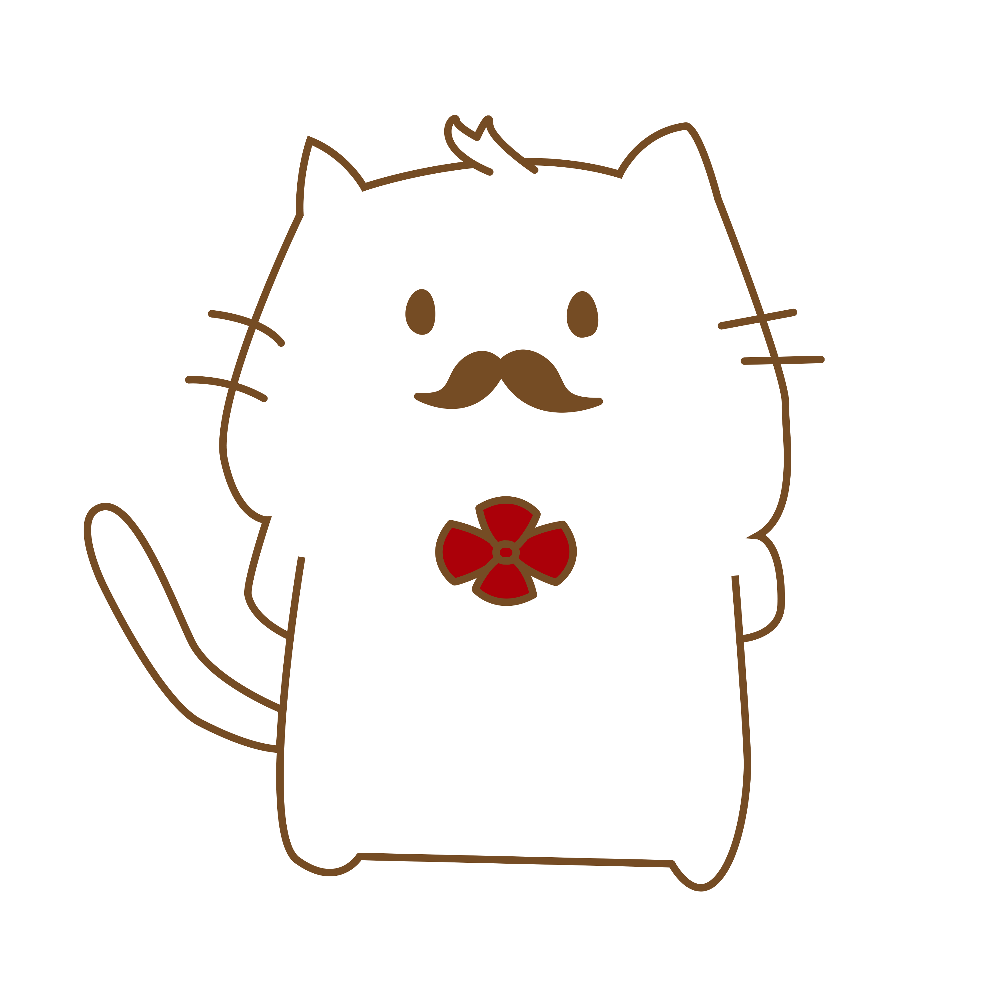

# nyantaro

<!-- 

    
    

        <h3 class="section_title center_title">にゃん太郎さん</h3>
        

            
にゃん太郎さんは村のみんなととても仲良しで、誰とでも打ち解けられる性格。冒険好きで、いつもパワフルに活動している。基本真面目で優しい。恋愛に対して鈍感な部分がある。ひよこさんと気が合い、いつも一緒にいる。ひよこさんの病気のことは知らない。
            

            <h4 class="section_subtitle">特技</h4>
            
畑で野菜作り。運動。

            <h4 class="section_subtitle">趣味</h4>
            
花畑でお花のアートを作ること。

            <h4 class="section_subtitle">好きな言葉</h4>
            
みんな違ってみんな良い！

            
みんなに一言！

            
やっほう！これからもよろしくね！

        

    
 -->